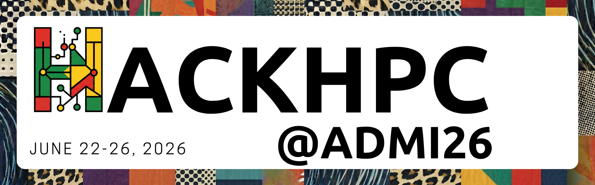

# HackHPC@ADMI26 Hackathon 

## Description
SGX3's Association of Computer Science Departments at Minority Institutions (ADMI) Hackathon will take place June 22 - 26, 2026 virtually. The teams will focus on the application of Science Gateway development skills as an extention to the ADMI 2025 Symposium on Computing at Minority Institutions theme "Fine Tuning AI Models". Pre-training events have been provided in coordiniation with the SGX3 2026 Virtual Coding Institute.

- Date: June 22-26, 2026
- Location: Virtual

## Registration Now Open!: [https://forms.gle/MdeeTz91kZvGyJFR8](https://forms.gle/MdeeTz91kZvGyJFR8) 
